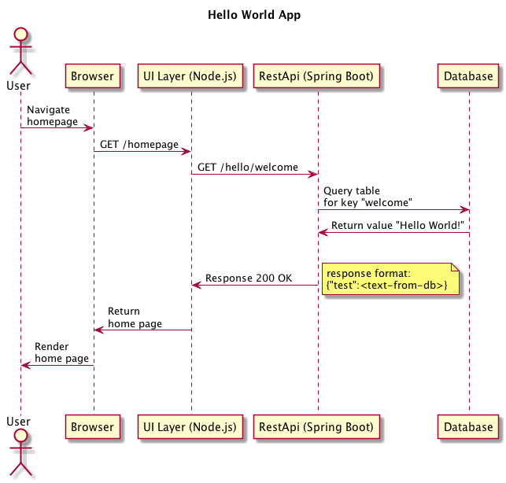

# Hello World Example 

To get familiar with how an Alfresco Engineer or a Solution Developer can build and use a deployment package for Kubernetes we have created a simple hello world app that you can use for reference as you get started.

The application consists of several components:
- Database to store the data, postgres in our case
- Backend rest service to Create/Read/Update/Delete entries in the db
- Frontend app to proxy the backend service

The interactions between the components is shown in the following diagram:



## Prerequisites

- A running Kubernetes cluster (this can be [minikube](https://kubernetes.io/docs/getting-started-guides/minikube/) or a cluster on [AWS](https://aws.amazon.com/blogs/compute/kubernetes-clusters-aws-kops/))
- [Helm](https://github.com/kubernetes/helm/blob/master/docs/install.md) client is installed locally and deployed to your cluster
- [kubectl](https://kubernetes.io/docs/tasks/tools/install-kubectl/) is insallted and configured for your cluster

## How to Deploy

1. Create your working namespace:

```bash
kubectl create namespace example 
```

2. Generate a base64 value for your dockercfg, this will allow Kubernetes to access docker-internal.alfresco.com

```bash
cat ~/.docker/config.json | base64 
```

NOTE: If you're using Docker for Mac ensure your "Securely store docker logins in macOS keychain" preference is OFF before running this step.

3. Navigate to the helm folder and insert the base64 string generated in the previous step to <code>.dockerconfigjson</code> in <code>secrets.yaml</code>

4. Create your secret in your previously defined namespace.

```bash
kubectl create -f secrets.yaml --namespace example
```

5. Deploy the helm chart in your namespace.

If you're deploying to your local minikube use the following command:

```bash
helm install hello-world-app --namespace=example
```

If you're deploying to an AWS cluster use the command below. This will cause Kubernetes to generate an Elastic Load Balancer providing access to the application.

```bash
helm install hello-world-app --set service.type=LoadBalancer --namespace=example
```

## Running the App

1. Run the following command to get a list of your releases:

```bash
helm ls
```

2. Run the command below with the appropriate release name and namespace to get the base URL for the application:

```bash
<code-root>/examples/hello-world/scripts/get-app-url.sh [release] [namespace]
```

3. Navigate to the returned URL to use the UI or add <code>/hello/welcome</code> to the URL to access the backend service's REST API.