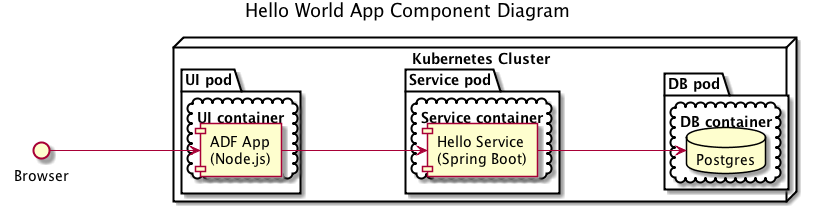
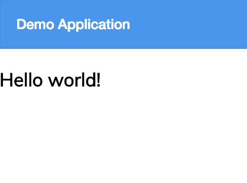
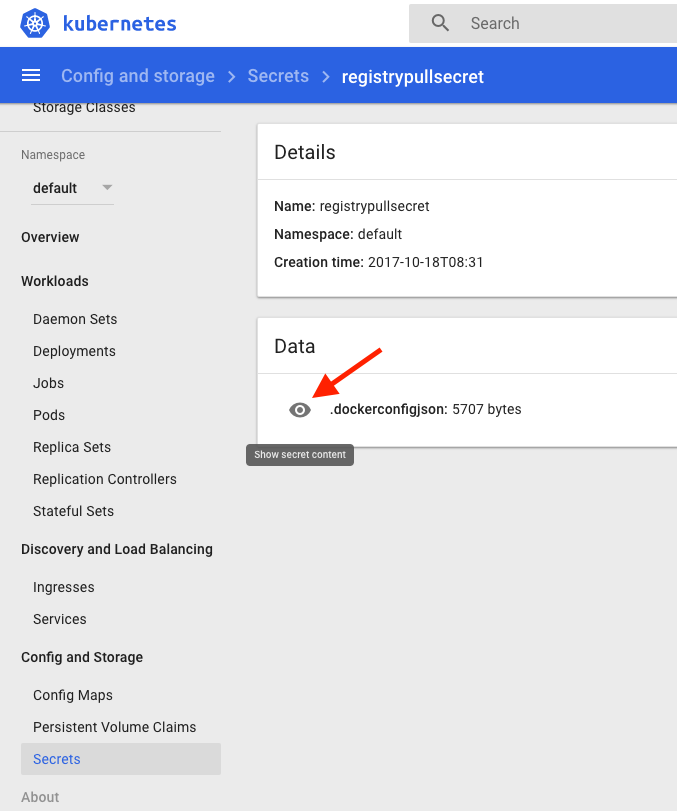

# Hello World Example 

To get familiar with how an Alfresco Engineer or a Solution Developer can build and use a deployment package for Kubernetes we have created a simple hello world app that you can use for reference as you get started.

The application consists of several components:
- Database to store the data, postgres in our case
- Backend rest service to Create/Read/Update/Delete entries in the db
- Frontend app to proxy the backend service

The components, how they are packaged and deployed is shown in the diagram below:



The interactions between the components is shown in the following diagram:


## Prerequisites

- A running Kubernetes cluster (this can be [minikube](https://kubernetes.io/docs/getting-started-guides/minikube/) or a cluster on [AWS](https://aws.amazon.com/blogs/compute/kubernetes-clusters-aws-kops/))
- [Helm](https://github.com/kubernetes/helm/blob/master/docs/install.md) client is installed locally and deployed to your cluster
- [kubectl](https://kubernetes.io/docs/tasks/tools/install-kubectl/) is installed and configured for your cluster

## How to Deploy

1. Create your working namespace:

```bash
kubectl create namespace example 
```

2. Generate a base64 value for your dockercfg, this will allow Kubernetes to access docker-internal.alfresco.com

```bash
cat ~/.docker/config.json | base64 
```

NOTE: If you're using Docker for Mac ensure your "Securely store docker logins in macOS keychain" preference is OFF before running this step.

3. Navigate to the helm folder and insert the base64 string generated in the previous step to <code>.dockerconfigjson</code> in <code>secrets.yaml</code>

4. Create your secret in your previously defined namespace.

```bash
kubectl create -f secrets.yaml --namespace example
```
5. Update the chart dependencies to pull the postgres chart used to deploy the db.

```bash
helm dep update hello-world-app
```

You should see output something similar to below.

<pre>
Hang tight while we grab the latest from your chart repositories...
...Unable to get an update from the "local" chart repository (http://127.0.0.1:8879/charts):
        Get http://127.0.0.1:8879/charts/index.yaml: dial tcp 127.0.0.1:8879: getsockopt: connection refused
...Successfully got an update from the "stable" chart repository
Update Complete. ⎈Happy Helming!⎈
Saving 1 charts
Downloading postgresql from repo https://kubernetes-charts.storage.googleapis.com
Deleting outdated charts
</pre>

6. Deploy the helm chart in your namespace.

If you're deploying to your local minikube use the following command:

```bash
helm install hello-world-app --namespace=example
```

If you're deploying to an AWS cluster use the command below. This will cause Kubernetes to generate an Elastic Load Balancer providing access to the application and service.

```bash
helm install hello-world-app --set ui.service.type=LoadBalancer --set backend.service.type=LoadBalancer --namespace=example
```

7. Check that the deployment worked by running the command below:

```bash
kubectl get pods --namespace example
```

You should see output something similar to below. The first time you deploy the status column will say <code>ContainerCreating</code> for a while as it needs to download the docker image. If the status column shows an error take a look at the Troubleshooting section.

<pre>
NAME                                                       READY     STATUS    RESTARTS   AGE
yucky-dragonfly-hello-world-app-backend-1490554866-6r84w   1/1       Running   0          1h
yucky-dragonfly-hello-world-app-ui-2548061476-4szl0        1/1       Running   0          1h
yucky-dragonfly-postgresql-925877059-5tk09                 1/1       Running   0          1h
</pre>

## Running the App

1. Run the following command to get a list of your releases:

```bash
helm ls
```

2. Run the command below with the appropriate release name and namespace to get the base URL for the application:

```bash
<code-root>/examples/hello-world/scripts/get-app-url.sh [release] [namespace]
```

3. Navigate to the returned URL to use the UI or add <code>/hello/welcome</code> to the URL to access the backend service's REST API. The screenshot below shows what you should see.



## Troubleshooting

If the deployment is not working correctly list the pods by executing:

```bash
kubectl get pods --namespace example
```

If a pod is showing an error in the Status column run the following command to get more detailed information:

```bash
kubectl describe pod <pod-name> --namespace example
```

If the events indicate there is a problem fetching the docker image check that the secret created in the Deploy section contains credentials. The easiest way to do this is to use the Kubernetes dashboard as shown in the screenshot below. Click the eye icon to see the secret contents.



To get to the dashboard if you're using minikube type <code>minikube dashboard</code>. If you're using an AWS based Kubernetes cluster, typically you'll use <code>https://api-server-hostname/ui</code>. You'll need to contact your administrator for authentication details or examine your local kubeconfig file.

If the credentials are missing check they are present in ~/.docker/config.json, especially if you're running on a Mac as the "Securely store docker logins in macOS keychain" preference maybe enabled.

If you have a [locally built docker image](../../docs/tips-and-tricks.md#using-locally-built-docker-image-in-minikube) you want to test you can prevent the latest image from being pulled by deploying with the following command:

```bash
helm install --set ui.image.pullPolicy=IfNotPresent --set backend.image.pullPolicy=IfNotPresent hello-world-app
```